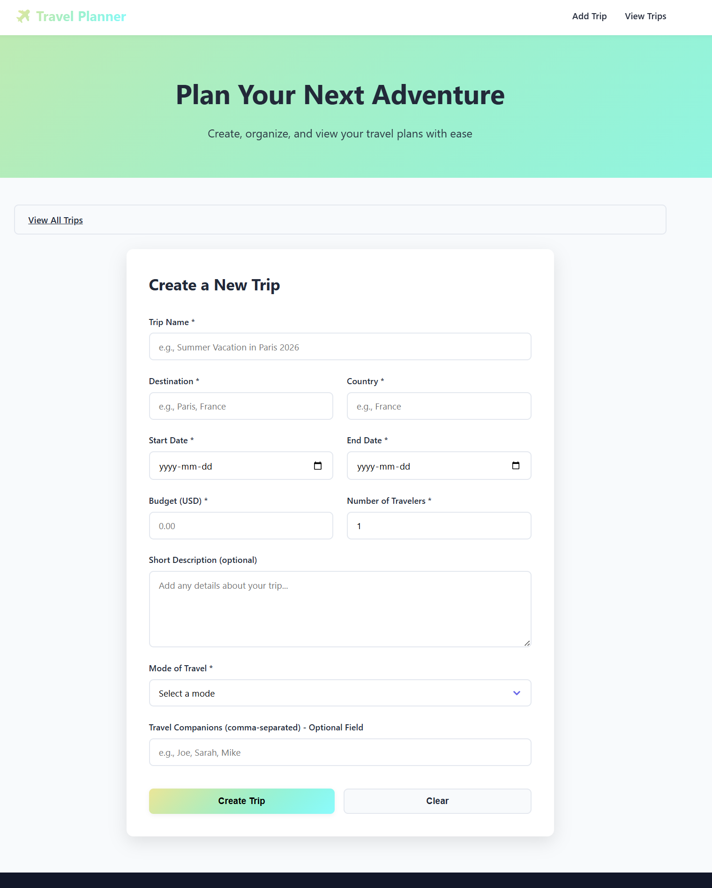
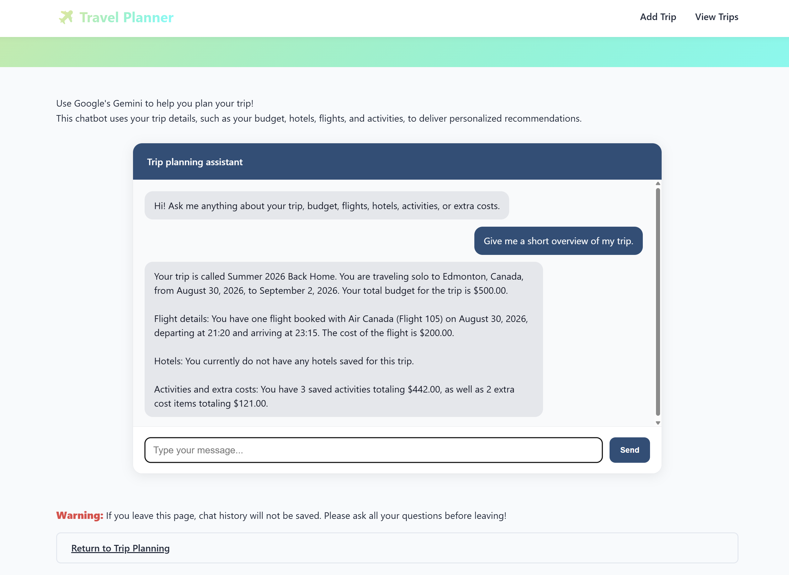

# Travel-Planner

A full-stack travel planning web application that helps users organize trips by managing flights, hotels, activities, expenses, and key trip details in one place. The application uses Flask and SQLite for backend logic and persistent data storage, and integrates Open-Meteo for weather forecasts. Users can also interact with a Gemini-powered AI travel assistant that uses saved trip data to provide personalized planning assistance.

## Features
* Create, view, edit, and delete trips through a full-stack web interface
* Organize flights, hotels, activities, and additional expenses for each trip
* Track key trip details including destination, travel dates, budget, travelers, and notes
* Persist trip data with SQLite, allowing information to be saved and retrieved across application sessions
* View available weather forecasts for upcoming trips using data from Open-Mateo Weather API
* Provide an AI travel assistant powered by the Gemini API that uses saved trip information to answer trip-specific questions

## Screenshots
### Creating a New Trip


### AI Travel Assistant


## Technologies Used
* Python
* HTML/CSS
* Flask
* Jinja
* SQLite
* Open-Mateo API
* Gemini API

## Installation
1. Clone the repository:
```
git clone <https://github.com/IJustinChan/Travel-Planner.git>
```

2. Navigate to the project directory:
```
cd Travel-Planner
```

3. Install the required Python packages:
```
pip install -r requirements.txt
```

## Gemini Api Key Setup
This project uses the Gemini API for the AI travel assistant. You will need to get your own Gemini API key before running the application.

Please visit Google AI Studio and use your Google Account to generate your own Gemini API key: https://aistudio.google.com/

Next, copy and paste your API key into line 16 of `main.py`:
```
client = genai.Client(api_key="YOUR_API_KEY_HERE")
```

Do not commit API keys to the repository.

## Running the Program
Once you have added your API key, start the Flask application by running `main.py`. Click the link that is generated and you will be able to access the website. 

## Project Structure
```
TRAVEL-PLANNER/
├── static/
│   ├── script.js
│   └── style.css
├── templates/
│   ├── add_activity_route.html
│   ├── add_extra_cost_route.html
│   ├── add_flight_route.html
│   ├── add_hotel_route.html
│   ├── chatbot.html
│   ├── home.html
|   ├── itinerary.html
│   ├── plan.html
│   ├── trips.html
│   └── weather_forecasts.html
├── chatbot_gemini.py
├── main.py
├── trips.db
└── weather_information.py
```
